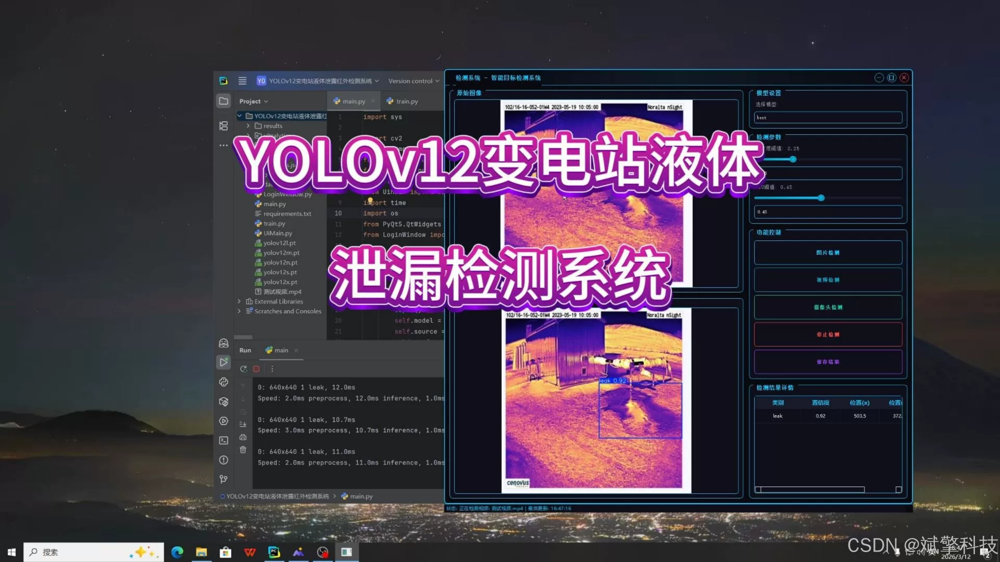
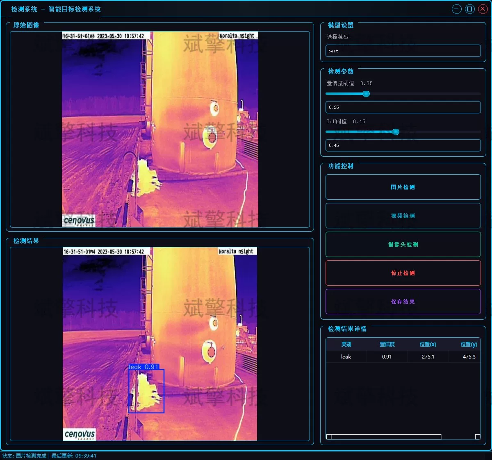
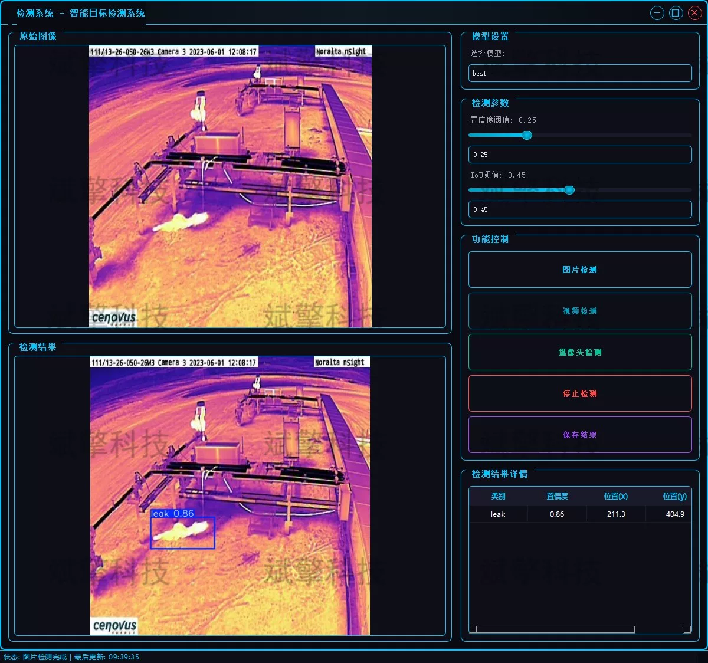
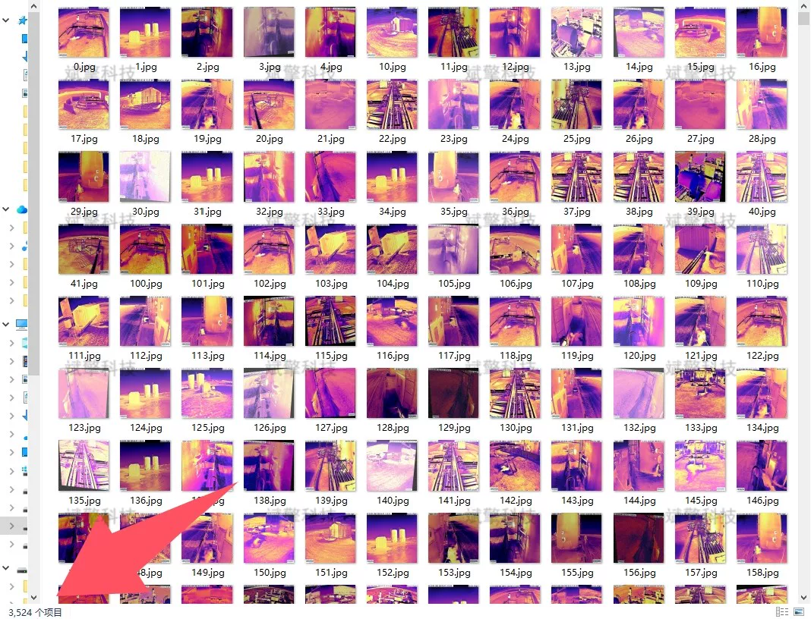
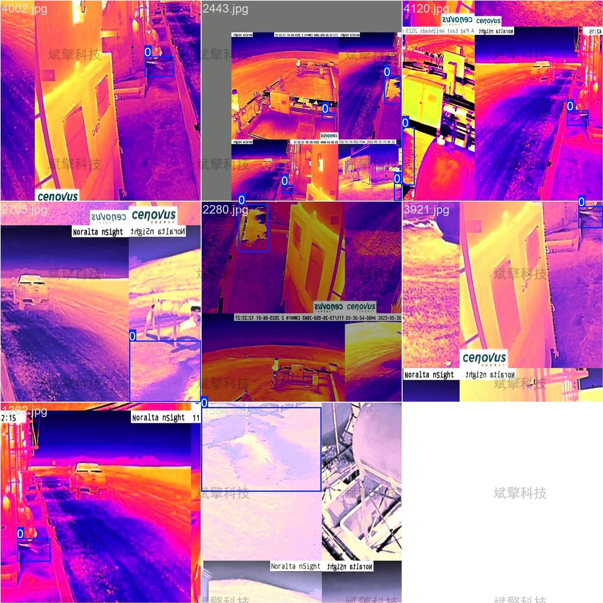
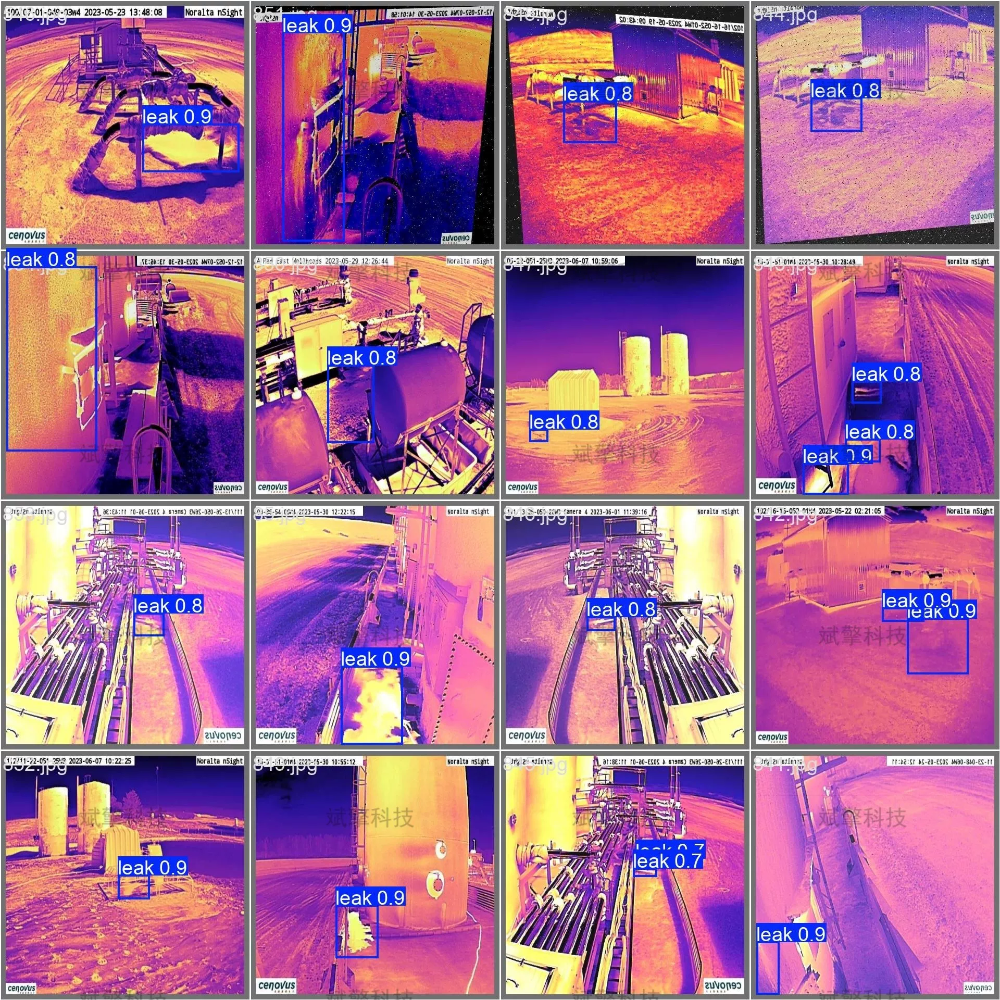

# Based on deep learning YOLOv12 for liquid leak detection in substations (YOLO)

## Body

Based on the latest YOLOv12 (You Only Look Once version 12) object detection algorithm, this system is built. The YOLO series algorithms, with their excellent balance of detection speed and accuracy, are widely used in industrial defect detection. Compared to its predecessors, YOLOv12 has been optimized in the backbone network and feature fusion layer, which enhances its feature extraction capability, making it particularly suitable for scenes with less texture information but clear temperature characteristics such as infrared images.
The system utilizes infrared thermal imaging technology to capture the differences in device temperature fields. In combination with the cutting-edge YOLOv12 object detection algorithm, it achieves intelligent recognition and localization of leakage areas. This system not only supports offline analysis of leakage in static images and dynamic videos but also integrates real-time camera detection functions, enabling connection to inspection robots or fixed monitoring devices, providing an efficient and precise solution for unmanned inspection and fault early warning in power substations.

System Function Overview

✅ User Login and Registration: Supports password verification and security validation.

✅ Three Detection Modes: Based on the YOLOv12 model, supports image, video, and real-time camera detection, accurately recognizes targets.

✅ Dual-Screen Comparison: Displays the original image and detection results on the same screen.

✅ Data Visualization: Real-time table displaying the category, confidence, and coordinates of detected targets.

✅ Intelligent Parameter Tuning: Offers a confidence slide bar for dynamic optimization of detection accuracy, adapting to different scene needs.

✅ Sci-Fi Interactive Interface: Dark theme combined with dynamic light effects, reducing visual fatigue and improving operational experience.

✅ Multi-Thread High-Performance Architecture: Independent detection threads ensure smooth operation, real-time status prompts, and rapid response without lag.

Dataset Introduction

Training set: A total of 3,524 images.
Validation set: A total of 504 images.
Test set: A total of 1,007 images.

## Images

## Payment

Here is a pay link on Stripe ( https://buy.stripe.com/3cs8yP7sY87d0vu9AB ). Please contact me lonlonago@foxmail.com after funding $89, and I will send you a complete data files , thank you!

